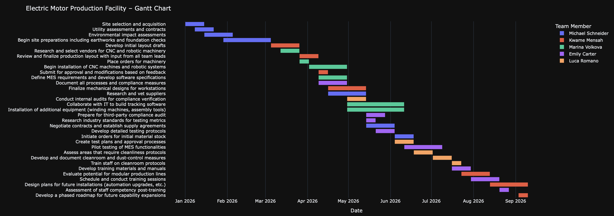

# Planning Agent

A multi-agent system for automated project planning and resource allocation using CrewAI framework.

## Overview

This tool automates the process of breaking down complex projects into manageable tasks, estimating time and resources, and allocating work to team members. It generates comprehensive project plans with Gantt chart visualization.

## Features

- **Automated Task Breakdown**: Analyzes project requirements and decomposes them into actionable tasks
- **Time and Resource Estimation**: Provides realistic estimates for task duration and required resources
- **Resource Allocation**: Optimally assigns tasks to team members based on skills and availability
- **Gantt Chart Generation**: Creates visual project timelines with team member assignments
- **Structured Output**: Generates standardized project plans with tasks, milestones, and deliverables

## Architecture

The system consists of three specialized AI agents:

1. **Project Planning Agent**: Breaks down project requirements into detailed tasks with timelines and dependencies
2. **Estimation Agent**: Analyzes task complexity to provide accurate time and resource estimates
3. **Resource Allocation Agent**: Assigns tasks to team members and creates the final project plan

## Configuration

- `config/agents.yaml`: Defines agent roles, goals, and capabilities
- `config/tasks.yaml`: Specifies task descriptions and expected outputs
- `.env`: Contains API keys (OpenAI required)

## Usage

The system takes project inputs including:
- Project type and objectives
- Industry context
- Team member profiles
- Detailed requirements

It outputs a structured project plan with:
- Task breakdown with start/end weeks
- Resource requirements per task
- Project milestones and deliverables
- Visual Gantt chart representation

## Requirements

- Python 3.12+
- CrewAI framework
- OpenAI API access
- Plotly for visualization
- Kaleido for chart export

## Example Use Case

The included example demonstrates planning for an "Electric Motor Production Facility" project in aerospace manufacturing, showing how the system handles complex industrial projects with multiple stakeholders and technical requirements.

  
  
<em>Example Gantt chart generated for Electric Motor Production Facility project showing task timelines and team member assignments</em>

View the interactive Gantt Chart [here](https://yauheniya-ai.github.io/planning-agent/gantt_chart.html)
